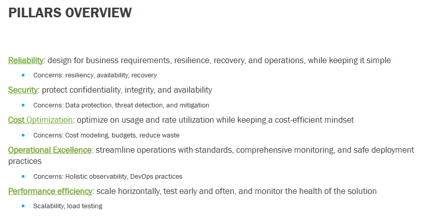

# Requirements and Design Documentation

## Infrastructure Architecture Design

- **GitHub**
- **App Service for containers**
- **App Service Plan**
- **PostgreSQL database**
- **Static website**
- **Azure Container Registry**
- **Key Vault**
- **Log Analytics Workspace**
- **Application Insights**
- **_(TO DO: Any other service to be used (Has to be coordinated with the rest of the team))_**

## Environment Design

- **Which environments do we need for our workloads?**
  - And what configuration will our Azure services have for each environment?
- with the infra dev and the full stack dev

## Well-Architected Framework

- **Reliability**
  - with site reliability engineer
  - SLI 1: Account Availability: Ensure 95% of account access requests are successful.
  - SLI 2: Time to Access: Ensure 85% of page requests are loaded within 500ms.
  - SLI 3: Transaction Processing Time: Ensure 99% of transactions are completed within 2 seconds.
- **Security**
  - with cybersec engineer
  - SLI 4: Login Success Rate: Ensure 99.9% of login attempts are successful without errors due to system issues.
  - SLI 5: Fund Transfer Accuracy: Ensure 99.99% of fund transfers are accurate and error-free.
- **Cost Optimization**
  - SKU tier optimization: we will set the SKU to 'free' for the dev enviornment to reduce cost in this low traffic environment. The UAT and Production environment SKUs will be set to 'basic', which also are more cost-effective.
  - CDN Configuration (static site): enabled in the production environment to improve performance and reduce bandwidth costs, which reduces latency for global users, and decreases data transfer costs through caching.
  - CostCenter tag (static site): this will be enabled to provide cost tracking.
  - ... add more based on other bicep files created
- **Operational Excellence**
  - with full stack dev
  - Collaborate to create Azure Dashboards for SLO compliance tracking and holistic observability.
- **Performance Efficiency**
  - CDN (static site): enabled in the production environment to deliver static content efficiently to users, reducing latency and improving page load times for users.
  - Private endpoints (static site and database): ensures secure, low latency communication between resources
  - Application insights monitoring: Integrated for all environments to monitor application performance metrics and identify bottlenecks, allowing for proactive optimization.
  - ... to be continued
  - Conduct load testing for SLI 2: Page Load Time and SLI 3: Transaction Processing Time.
  - Optimize scalability of infrastructure to handle peak loads while maintaining performance thresholds.

## Release Strategy

## CI/CD Pipeline and Release Strategy
Makenna's step 3... coming soon

## Use Cases and Sequential Model Diagrams
Must include for each use case

## Entity Relationship Diagram for the Database

## 12 Factor App Design

## Documented User Stories
